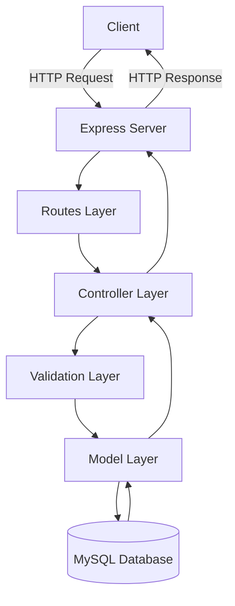

# Architecture

The Sales Management System follows a layered **Model-View-Controller (MVC)** architecture pattern with clear separation of concerns.

## System Overview



## Architecture Pattern: MVC

The system implements a classic **Model-View-Controller** pattern adapted for RESTful APIs:

- **Model**: Data access and business logic (`src/model/`)
- **View**: JSON responses (no template engine)
- **Controller**: Request handling and orchestration (`src/controller/`)

## Directory Structure

```
src/
├── index.js                 # Application entry point
├── config.js               # Configuration settings
├── routes/                 # Route definitions
│   ├── routes.js          # Main router
│   ├── categories.route.js
│   ├── products.route.js
│   ├── clients.route.js
│   └── sales.route.js
├── controller/            # Request handlers
│   ├── categories/
│   │   ├── createCategorie.js
│   │   ├── getCategorie.js
│   │   ├── getCategories.js
│   │   └── deleteCategorie.js
│   ├── products/
│   │   ├── createProduct.js
│   │   ├── getProduct.js
│   │   ├── getProducts.js
│   │   ├── updateProduct.js
│   │   └── deleteProduct.js
│   ├── clients/
│   │   ├── createClient.js
│   │   ├── getClient.js
│   │   ├── getClients.js
│   │   ├── updateClient.js
│   │   └── deleteClient.js
│   ├── sales/
│   │   ├── createSales.js
│   │   ├── getSale.js
│   │   ├── getSales.js
│   │   ├── updateSales.js
│   │   └── deleteSales.js
│   └── validation/        # Zod schema validators
│       ├── categorie.validation.js
│       ├── products.validation.js
│       ├── client.validation.js
│       └── sales.validation.js
└── model/                 # Database queries
    ├── pool.js           # Connection pool
    ├── database.sql      # Schema definition
    ├── categorie.model.js
    ├── products.model.js
    ├── clients.model.js
    └── sales.model.js
```

## Request Flow

The system processes requests through a sequential pipeline:

### 1. Entry Point (`src/index.js`)

The Express application is initialized:

```javascript
import express from "express"
import routes from "./routes/routes.js";
import config from "./config.js";

const app = express();
app.use(express.json());
app.use(express.urlencoded())

app.use(routes)

app.listen(config.PORT, (err) => {
    if (err) console.log(err)
    else {
        console.log(`Server on port http://localhost:${config.PORT}`)
    }
})
```

**Key components:**
- Express middleware for JSON and URL-encoded body parsing
- Central route registration
- Server listening on configured port (default: 3000)

### 2. Routes Layer (`src/routes/`)

Routes define URL patterns and map them to controllers:

```javascript
import { Router } from "express";
const routes = Router();

import clients from "./clients.route.js"
import categories from "./categories.route.js"
import products from "./products.route.js"
import sales from "./sales.route.js"

routes.use(sales)
routes.use(products)
routes.use(clients);
routes.use(categories)

export default routes;
```

**Route organization:**
- Each resource (categories, products, clients, sales) has its own route file
- RESTful URL patterns
- HTTP method mapping (GET, POST, PATCH, DELETE)

### 3. Controller Layer (`src/controller/`)

Controllers handle request processing and orchestration:

```javascript
import { validateCategorie } from "../validation/categorie.validation.js"
import { createCategorie } from "../../model/categorie.model.js"

const isEmpty = (body) => !body || Object.keys(body).length == 0

const createCategorieController = async (req, res) => {
    if (isEmpty(req.body)) 
        return res.status(400).json({ error: true, msg: "request body is empty" })

    const { name } = req.body;

    const validCategorie = await validateCategorie(name)
    if (!validCategorie) 
        return res.status(400).json({ error: true, msg: "categorie name is invalid" })

    const data = await createCategorie(name)
    if (data.error) 
        return res.status(409).json({ error: true, msg: "categorie name exist" })
    
    return res.status(200).json({ error: false, msg: "categorie was created sucessfully" })
}

export default createCategorieController;
```

**Controller responsibilities:**
- Extract request data (body, params, query)
- Validate request body is not empty
- Call validation layer
- Invoke model methods
- Format and return responses
- Set appropriate HTTP status codes

### 4. Validation Layer (`src/controller/validation/`)

Validators use **Zod** for schema validation:

```javascript
import z from "zod";

const schemmaName = z.string().min(3)
const schemmaId = z.int().min(1)

export const validateCategorie = async (categorie) => {
    let result = await schemmaName.safeParseAsync(categorie)
    return result.success;
}

export const validateId = async (id) => {
    id = parseInt(id);
    const success = (await schemmaId.safeParseAsync(id)).success
    return success
}
```

**Validation rules:**
- **Categories**: name min 3 characters
- **Products**: 
  - name min 3 characters
  - description min 10 characters
  - price must be positive number
  - stock must be non-negative integer
- **Clients**: 
  - name min 3 characters
  - valid email format
- **Sales**: 
  - valid client UUID
  - valid product UUIDs
  - quantity must be positive

<Note>
  Zod's `safeParseAsync` returns `{success: boolean, data?: T, error?: ZodError}` without throwing exceptions.
</Note>

### 5. Model Layer (`src/model/`)

Models handle database queries and business logic:

```javascript
import { pool } from "./pool.js";

export function getCategorie(id) {
    return pool.query(
        "SELECT * FROM categories WHERE id = ?",
        id
    ).then((row) => {
        if (row[0].length === 0) 
            return { error: true, msg: "Categorie no exits" }
        else 
            return { error: false, msg: "Categorie got sucessfully", categorie: row[0][0] }
    }).catch((err) => { 
        return { error: true, msg: "Query of getCategorie fail" } 
    })
}

export function createCategorie(name) {
    return pool.query(
        "INSERT INTO categories (name) VALUES (?)",
        [name]
    ).then(() => {
        return { error: false, msg: "categorie created sucessfully" }
    }).catch((err) => {
        return { error: true, msg: "Query of createCategories fail" }
    })
}

export function deleteCategorie(id) {
    if (!id) return { error: true, msg: "the id field is missing" }
    
    return pool.query(
        `SELECT BIN_TO_UUID(id) as id FROM products WHERE category_id = ?`,
        [id]
    ).then((value) => {
        if (value[0].length != 0) {
            throw new Error(JSON.stringify({ 
                error: true, 
                msg: "there are products with this category", 
                productList: value[0] 
            }))
        } else {
            return pool.query(
                "DELETE FROM categories WHERE id = ?",
                [id]
            )
        }
    }).then((row) => {
        return { error: false, msg: "Categorie deleted successfully" };
    }).catch((err) => {
        return JSON.parse(err.message)
    })
}
```

**Model responsibilities:**
- Execute SQL queries using connection pool
- Handle UUID conversion (`BIN_TO_UUID`, `UUID_TO_BIN`)
- Enforce business rules (e.g., foreign key constraints)
- Return standardized response objects
- Catch and format database errors

### 6. Database Connection Pool

The system uses **mysql2** with connection pooling for efficiency:

```javascript
import { createPool } from 'mysql2/promise';
import config from '../config.js';

export const pool = createPool({
    host: config.HOST_DATABASE,
    port: config.PORT_DATABASE,
    database: config.DATABASE_NAME,
    user: config.USER_DATABASE,
    password: config.PASSWORD_DATABASE
});
```

**Connection pooling benefits:**
- Reuses connections instead of creating new ones
- Automatically manages connection lifecycle
- Improves performance under high load
- Handles connection failures gracefully

## Design Patterns

### Repository Pattern

Models act as repositories, abstracting database access:

```javascript
// Controller doesn't know SQL details
const categories = await getCategories();

// Model handles the query
export function getCategories() {
    return pool.query("SELECT * FROM categories")
        .then((row) => row[0])
        .catch((err) => ({ error: true, msg: "Query failed" }))
}
```

### Promise-based Async Flow

All database operations return promises:

```javascript
// Async/await in controllers
const data = await createCategorie(name);
if (data.error) return res.status(409).json(data);

// Promise chains in models
return pool.query(...)
    .then(...)
    .catch(...)
```

### Dependency Injection

Controllers import dependencies explicitly:

```javascript
import { validateCategorie } from "../validation/categorie.validation.js"
import { createCategorie } from "../../model/categorie.model.js"
```

This makes testing easier and dependencies explicit.

### Error Response Standardization

All responses follow a consistent format:

```javascript
// Success response
{
    "error": false,
    "msg": "Operation successful",
    "data": {...}
}

// Error response
{
    "error": true,
    "msg": "Error description",
    "details": [...]
}
```

## Data Flow Example

Create a category request flow:

```
1. Client sends POST /categories {"name": "bebidas"}
   ↓
2. Express parses JSON body
   ↓
3. Route matches POST /categories → createCategorieController
   ↓
4. Controller extracts {name} from body
   ↓
5. Controller calls validateCategorie("bebidas")
   ↓
6. Validation layer checks: string.min(3) ✓
   ↓
7. Controller calls createCategorie("bebidas")
   ↓
8. Model executes INSERT INTO categories (name) VALUES ('bebidas')
   ↓
9. MySQL stores record and returns success
   ↓
10. Model returns {error: false, msg: "..."}
    ↓
11. Controller formats response
    ↓
12. Express sends JSON: {"error": false, "msg": "categorie was created sucessfully"}
```

## ES Modules

The entire codebase uses **ES6 modules** (`import`/`export`):

```json
{
  "type": "module"
}
```

**Benefits:**
- Modern JavaScript syntax
- Static analysis and tree-shaking
- Explicit dependencies
- Native browser compatibility (future-proof)

## Middleware Pipeline

```javascript
Request
  ↓
app.use(express.json())           // Parse JSON bodies
  ↓
app.use(express.urlencoded())     // Parse URL-encoded bodies
  ↓
app.use(routes)                   // Route to controllers
  ↓
Controller validation & processing
  ↓
Response
```

## Security Considerations

### SQL Injection Prevention

All queries use **parameterized statements**:

```javascript
// Safe - parameterized
pool.query("SELECT * FROM categories WHERE id = ?", [id])

// Unsafe - string concatenation (NOT used)
// pool.query(`SELECT * FROM categories WHERE id = ${id}`)
```

### Input Validation

Zod validates all inputs before database operations:

```javascript
const validCategorie = await validateCategorie(name)
if (!validCategorie) 
    return res.status(400).json({ error: true, msg: "categorie name is invalid" })
```

### Error Message Sanitization

Database errors are caught and returned with generic messages:

```javascript
.catch((err) => { 
    return { error: true, msg: "Query of createCategories fail" } 
})
```

<Warning>
  Never expose raw database errors to clients in production. They may reveal schema details or SQL queries.
</Warning>

## Performance Optimizations

### Connection Pooling

Reuses database connections instead of creating new ones per request.

### Prepared Statements

mysql2 automatically caches prepared statements, improving performance for repeated queries.

### Async/Await

Non-blocking I/O allows handling multiple requests concurrently.

### Auto-reload in Development

```json
{
  "scripts": {
    "dev": "node --watch src/index.js"
  }
}
```

Node.js `--watch` flag automatically restarts on file changes.

## Next Steps

<CardGroup cols={2}>
  <Card title="Database Schema" icon="database" href="/concepts/database-schema">
    Understand the data model
  </Card>
  <Card title="API Reference" icon="code" href="/api/overview">
    Explore all endpoints
  </Card>
  <Card title="Error Handling" icon="triangle-exclamation" href="/guides/error-handling">
    Handle errors properly
  </Card>
  <Card title="Configuration" icon="gear" href="/guides/configuration">
    Configure the application
  </Card>
</CardGroup>
