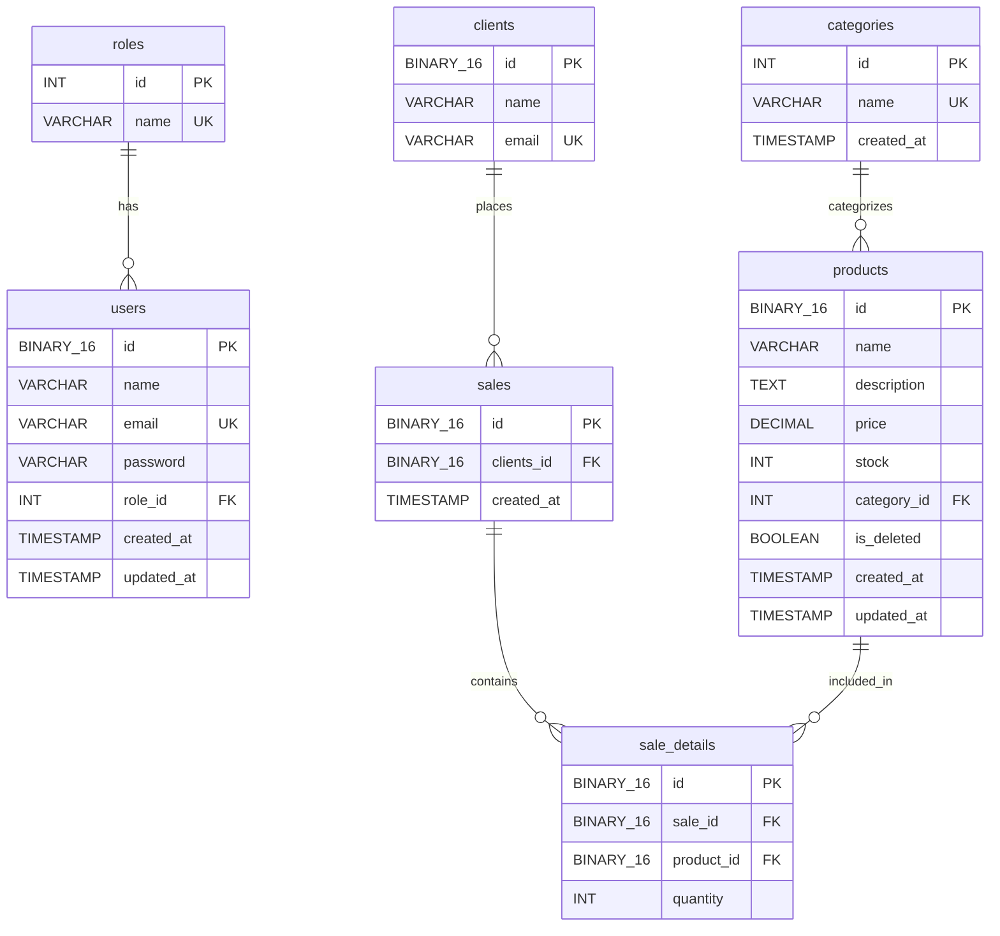

# Database Schema

The Sales Management System uses MySQL with a relational schema designed around sales, inventory, and client management.

## Overview

The database consists of 7 main tables:

- **roles** - User role definitions
- **users** - System user accounts
- **categories** - Product categorization
- **products** - Inventory items
- **clients** - Customer information
- **sales** - Sales transactions
- **sale_details** - Line items for each sale

## Schema Diagram



## Table Definitions

### roles

Defines user roles for access control.

```sql
CREATE TABLE roles (
    id INT AUTO_INCREMENT PRIMARY KEY,
    name VARCHAR(50) NOT NULL UNIQUE
);

INSERT INTO roles (name) VALUES ('admin'), ('employee');
```

| Column | Type | Constraints | Description |
|--------|------|-------------|-------------|
| id | INT | PRIMARY KEY, AUTO_INCREMENT | Unique role identifier |
| name | VARCHAR(50) | NOT NULL, UNIQUE | Role name (admin, employee) |

### users

Stores system user accounts with role-based access.

```sql
CREATE TABLE users (
    id BINARY(16) PRIMARY KEY,
    name VARCHAR(100) NOT NULL,
    email VARCHAR(150) NOT NULL UNIQUE,
    password VARCHAR(255) NOT NULL,
    role_id INT NOT NULL,
    created_at TIMESTAMP DEFAULT CURRENT_TIMESTAMP,
    updated_at TIMESTAMP DEFAULT CURRENT_TIMESTAMP ON UPDATE CURRENT_TIMESTAMP,
    FOREIGN KEY (role_id) REFERENCES roles(id)
);
```

| Column | Type | Constraints | Description |
|--------|------|-------------|-------------|
| id | BINARY(16) | PRIMARY KEY | UUID stored as binary |
| name | VARCHAR(100) | NOT NULL | User's full name |
| email | VARCHAR(150) | NOT NULL, UNIQUE | User email address |
| password | VARCHAR(255) | NOT NULL | Hashed password |
| role_id | INT | NOT NULL, FOREIGN KEY | Reference to roles.id |
| created_at | TIMESTAMP | DEFAULT CURRENT_TIMESTAMP | Account creation time |
| updated_at | TIMESTAMP | AUTO UPDATE | Last modification time |

<Note>
  User passwords should be hashed using bcrypt or similar before storage.
</Note>

### categories

Organizes products into categories.

```sql
CREATE TABLE categories (
    id INT AUTO_INCREMENT PRIMARY KEY,
    name VARCHAR(100) NOT NULL UNIQUE,
    created_at TIMESTAMP DEFAULT CURRENT_TIMESTAMP
);
```

| Column | Type | Constraints | Description |
|--------|------|-------------|-------------|
| id | INT | PRIMARY KEY, AUTO_INCREMENT | Unique category identifier |
| name | VARCHAR(100) | NOT NULL, UNIQUE | Category name (min 3 chars) |
| created_at | TIMESTAMP | DEFAULT CURRENT_TIMESTAMP | Creation timestamp |

**Example categories:** bebidas, alfajores, galletas

### products

Stores inventory items with pricing and stock information.

```sql
CREATE TABLE products (
    id BINARY(16) PRIMARY KEY,
    name VARCHAR(150) NOT NULL,
    description TEXT,
    price DECIMAL(10,2) NOT NULL,
    stock INT NOT NULL DEFAULT 0,
    category_id INT,
    is_deleted BOOLEAN DEFAULT FALSE,
    created_at TIMESTAMP DEFAULT CURRENT_TIMESTAMP,
    updated_at TIMESTAMP DEFAULT CURRENT_TIMESTAMP ON UPDATE CURRENT_TIMESTAMP,
    FOREIGN KEY (category_id) REFERENCES categories(id)
);
```

| Column | Type | Constraints | Description |
|--------|------|-------------|-------------|
| id | BINARY(16) | PRIMARY KEY | UUID for product |
| name | VARCHAR(150) | NOT NULL | Product name (min 3 chars) |
| description | TEXT | - | Detailed description (min 10 chars) |
| price | DECIMAL(10,2) | NOT NULL | Price with 2 decimal places |
| stock | INT | NOT NULL, DEFAULT 0 | Available quantity |
| category_id | INT | FOREIGN KEY | Reference to categories.id |
| is_deleted | BOOLEAN | DEFAULT FALSE | Soft delete flag |
| created_at | TIMESTAMP | DEFAULT CURRENT_TIMESTAMP | Creation time |
| updated_at | TIMESTAMP | AUTO UPDATE | Last update time |

**Example:**
```json
{
  "id": "b6da7bbc-14b9-11f1-9fcd-2418c6c96a00",
  "name": "Coca cola",
  "description": "Bebida gasificada de 2ltr",
  "price": "3000.00",
  "stock": 40,
  "category_id": 1
}
```

### clients

Stores customer information.

```sql
CREATE TABLE clients(
    id BINARY(16) PRIMARY KEY,
    name VARCHAR(100) NOT NULL,
    email VARCHAR(150) NOT NULL UNIQUE
);
```

| Column | Type | Constraints | Description |
|--------|------|-------------|-------------|
| id | BINARY(16) | PRIMARY KEY | UUID for client |
| name | VARCHAR(100) | NOT NULL | Client's full name |
| email | VARCHAR(150) | NOT NULL, UNIQUE | Client email address |

**Example:**
```json
{
  "id": "036c71c5-14e0-11f1-9fcd-2418c6c96a00",
  "name": "Mark Zuckemberg",
  "email": "markz@facebook.com"
}
```

### sales

Records sales transactions.

```sql
CREATE TABLE sales (
    id BINARY(16) PRIMARY KEY,
    clients_id BINARY(16) NOT NULL,
    created_at TIMESTAMP DEFAULT CURRENT_TIMESTAMP,
    FOREIGN KEY (clients_id) REFERENCES clients(id)
);
```

| Column | Type | Constraints | Description |
|--------|------|-------------|-------------|
| id | BINARY(16) | PRIMARY KEY | UUID for sale |
| clients_id | BINARY(16) | NOT NULL, FOREIGN KEY | Reference to clients.id |
| created_at | TIMESTAMP | DEFAULT CURRENT_TIMESTAMP | Sale timestamp |

<Warning>
  A sale cannot be deleted if the client has associated sales records. Handle client deletion carefully.
</Warning>

### sale_details

Stores line items for each sale transaction.

```sql
CREATE TABLE sale_details (
    id BINARY(16) PRIMARY KEY,
    sale_id BINARY(16) NOT NULL,
    product_id BINARY(16) NOT NULL,
    quantity INT NOT NULL,
    FOREIGN KEY (sale_id) REFERENCES sales(id) ON DELETE CASCADE,
    FOREIGN KEY (product_id) REFERENCES products(id)
);
```

| Column | Type | Constraints | Description |
|--------|------|-------------|-------------|
| id | BINARY(16) | PRIMARY KEY | UUID for sale detail |
| sale_id | BINARY(16) | NOT NULL, FOREIGN KEY | Reference to sales.id |
| product_id | BINARY(16) | NOT NULL, FOREIGN KEY | Reference to products.id |
| quantity | INT | NOT NULL | Quantity sold |

<Note>
  `ON DELETE CASCADE` ensures that when a sale is deleted, all its line items are automatically removed.
</Note>

## Relationships

### One-to-Many Relationships

1. **roles → users**: One role has many users
   - Enforced by: `users.role_id` → `roles.id`

2. **categories → products**: One category has many products
   - Enforced by: `products.category_id` → `categories.id`
   - Constraint: Cannot delete category if products exist with that category

3. **clients → sales**: One client has many sales
   - Enforced by: `sales.clients_id` → `clients.id`
   - Constraint: Cannot delete client if they have sales

4. **sales → sale_details**: One sale has many line items
   - Enforced by: `sale_details.sale_id` → `sales.id`
   - Cascade: Deleting a sale deletes all its details

5. **products → sale_details**: One product appears in many sales
   - Enforced by: `sale_details.product_id` → `products.id`
   - Constraint: Cannot delete product if it appears in sales

## UUID Usage

The system uses **BINARY(16)** to store UUIDs efficiently:

- **Tables using UUIDs**: users, clients, products, sales, sale_details
- **Tables using integers**: roles, categories

### Working with UUIDs

MySQL provides functions to convert between UUID strings and binary:

```sql
-- Convert UUID string to binary for INSERT
INSERT INTO clients (id, name, email) 
VALUES (UUID_TO_BIN('550e8400-e29b-41d4-a716-446655440000'), 'John', 'john@example.com');

-- Convert binary to UUID string for SELECT
SELECT BIN_TO_UUID(id) as id, name, email FROM clients;
```

The API handles UUID conversion automatically in model files (e.g., `src/model/categorie.model.js:33`).

## Stock Management

When a sale is created:

1. Product stock is validated (must have sufficient quantity)
2. Stock is decremented by the quantity sold
3. Transaction is recorded in `sale_details`

**Example:**

Before sale:
```json
{"stock": 40}
```

After selling 10 units:
```json
{"stock": 30}
```

## Soft Deletes

The `products` table uses a **soft delete** pattern:

- `is_deleted` field marks products as deleted without removing them
- Preserves referential integrity with existing sales
- Products can be filtered in queries: `WHERE is_deleted = FALSE`

## Indexes

### Primary Keys (Automatically Indexed)
- All `id` columns are indexed as primary keys

### Unique Indexes
- `roles.name`
- `users.email`
- `categories.name`
- `clients.email`

### Foreign Key Indexes (Automatically Created)
- `users.role_id`
- `products.category_id`
- `sales.clients_id`
- `sale_details.sale_id`
- `sale_details.product_id`

## Database Size Considerations

| Table | Estimated Size per Row |
|-------|------------------------|
| roles | ~60 bytes |
| users | ~500 bytes |
| categories | ~120 bytes |
| products | ~300 bytes |
| clients | ~270 bytes |
| sales | ~50 bytes |
| sale_details | ~50 bytes |

<Note>
  Actual size varies based on data length. TEXT fields in products can significantly increase row size.
</Note>

## Next Steps

<CardGroup cols={2}>
  <Card title="Architecture" icon="diagram-project" href="/concepts/architecture">
    Learn how the API interacts with the database
  </Card>
  <Card title="API Reference" icon="code" href="/api/overview">
    See how to query and modify data
  </Card>
  <Card title="Error Handling" icon="triangle-exclamation" href="/guides/error-handling">
    Handle foreign key constraint errors
  </Card>
  <Card title="Configuration" icon="gear" href="/guides/configuration">
    Configure database connection
  </Card>
</CardGroup>
